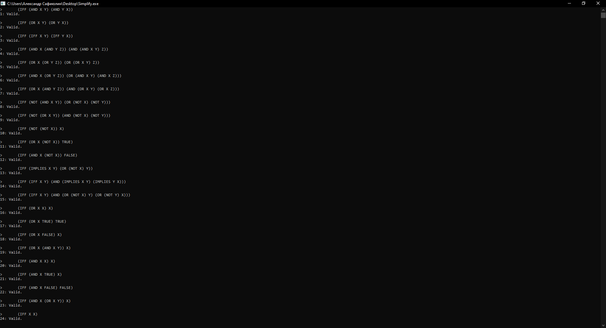
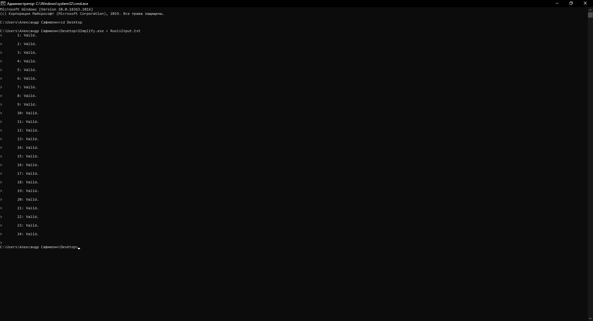

# Лабораторная работа №1
## Отчёт по лабораторной работе по дисциплине "Математические основы программирования" студента группы ПА-18-2 Сафиюлина Александра Александровича

### Постановка задачи

Тема: "Автоматизация доказательств тавтологий с помощью ПО **_Simplify_**"

Разделы лабораторной работы:
1. Ознакомиться с ПО **_Simplify_** по документации.
2. Применить ПО **_Simplify_** для доказательства утверждений: а) заданных с консоли; б) заданных в текстовом файле.
3. Применить ПО **_Simplify_** для доказательства 12 законов эквивалентности.

### Описание решения:

1. Выпишем 12 законов эквивалентности:
    * Законы коммутативности:  
       `X ∧ Y = Y ∧ X`  
       `X ∨ Y = Y ∨ X`  
       `X ≈ Y = Y ≈ X`  
    * Законы ассоциативвности:  
       `X ∧ (Y ∧ Z) = (X ∧ Y) ∧ Z`  
       `X ∨ (Y ∨ Z) = (X ∨ Y) ∨ Z`  
    * Законы дистрибутивности:  
       `X ∨ (Y ∧ Z) = (X ∨ Y) ∧ (X ∨ Z)`  
       `X ∧ (Y ∨ Z) = (X ∧ Y) ∨ (X ∧ Z)`  
    * Законы де Моргана:  
       `¬(X ∧ Y) = ¬X ∧ ¬Y`  
       `¬(X ∨ Y) = ¬X ∨ ¬Y`  
    * Закон отрицания:  
         `¬(¬X) = X`  
    * Закон исключения третьего:  
         `X ∨ ¬X = 1`  
    * Закон противоречия:  
         `X ∨ ¬X = 0`  
    * Закон импликации:  
         `X → Y = ¬X ∨ Y`  
    * Закон эквивалентонсти:  
        `X ≈ Y = (X → Y) ∧ (Y → X)`  
        `X ≈ Y = (¬X ∨ Y) ∧ (¬Y ∨ X)`  
    * Законы упрощения дизъюнкиции:  
        `X ∨ X = X`  
        `X ∨ 1 = 1`  
        `X ∨ 0 = X`  
        `X ∨ (X ∧ Y) = X`  
    * Законы упрощения конъюнкции:  
        `X ∧ X = X`  
        `X ∧ 1 = X`  
        `X ∧ 0 = 0`  
        `X ∧ (X ∨ Y) = X`  
    * Закон тождества:  
        `X = X`
2. Перепишем их с помощью синтаксиса **_Simplify_**:
    * Законы коммутативности:  
       `(IFF (AND X Y) (AND Y X))`  
       `(IFF (OR X Y) (OR Y X))`  
       `(IFF (IFF X Y) (IFF Y X))`
    * Законы ассоциативвности:  
       `(IFF (AND X (AND Y Z)) (AND (AND X Y) Z))`  
       `(IFF (OR X (OR Y Z)) (OR (OR X Y) Z))`  
    * Законы дистрибутивности:  
       `(IFF (AND X (OR Y Z)) (OR (AND X Y) (AND X Z)))`  
       `(IFF (OR X (AND Y Z)) (AND (OR X Y) (OR X Z)))`  
    * Законы де Моргана:  
       `(IFF (NOT (AND X Y)) (OR (NOT X) (NOT Y)))`  
       `(IFF (NOT (OR X Y)) (AND (NOT X) (NOT Y)))`  
    * Закон отрицания:  
         `(IFF (NOT (NOT X)) X)`  
    * Закон исключения третьего:  
         `(IFF (OR X (NOT X)) TRUE)`  
    * Закон противоречия:  
         `(IFF (AND X (NOT X)) FALSE)`  
    * Закон импликации:  
         `(IFF (IMPLIES X Y) (OR (NOT X) Y))`  
    * Закон эквивалентонсти:  
        `(IFF (IFF X Y) (AND (IMPLIES X Y) (IMPLIES Y X)))`  
        `(IFF (IFF X Y) (AND (OR (NOT X) Y) (OR (NOT Y) X)))`  
    * Законы упрощения дизъюнкиции:  
        `(IFF (OR X X) X)`  
        `(IFF (OR X TRUE) TRUE)`  
        `(IFF (OR X FALSE) X)`  
        `(IFF (OR X (AND X Y)) X)`  
    * Законы упрощения конъюнкции:  
        `(IFF (AND X X) X)`  
        `(IFF (AND X TRUE) X)`  
        `(IFF (AND X FALSE) FALSE)`  
        `(IFF (AND X (OR X Y)) X)`  
    * Закон тождества:  
        `(IFF X X)`
3. Проверим все законы в **_Simplify_**:
    
4. Создадим текстовый файл _RoolsInput.txt_ и запишем туда все формулы в синтаксисе **_Simplify_**:
5. Проверим все законы в **_Simplify_** с помощью созданого нами файла:
    
    
### Вывод

Несмотря на тот факт, что ПО **_Simplify_** несовершенно, так как изредка оно может не подтвердить верность истинного утверждения, это относительно эффективный способ доказательства примитивных формул первого порядка, ведь в отношении ложных утверждений ПО точное. Например, изучив базовый синтаксис приложения по англоязычной документации, мы сумели подтвердить с помощью **_Simplify_** 12 базовых законов эквивалентности алгебры логики.
